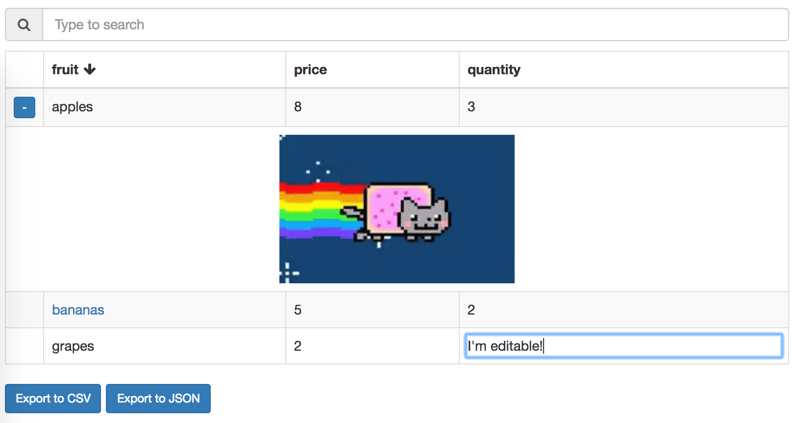

# reactable-search
Searchable table with simple JSON row definitions

[](https://circleci.com/gh/dbjohnson/reactable-search)
[](https://codeclimate.com/github/dbjohnson/reactable-search)
[](https://www.npmjs.com/package/reactable-search)
[]()


[](https://dbjohnson.github.io/reactable-search/demo)

[live demo](https://dbjohnson.github.io/reactable-search/demo)


## Description
This React component is a simple live-searchable table with some basic enhancements:

* Regex search
* Optionally editable cells with callback
* Optional separate values for display vs. sort
* Export to CSV and JSON
* Expandable rows

## Quickstart

### Install via npm
```bash
$ npm i reactable-search
```

### Run demo
```bash
$ npm run-script demo
```

## Usage

### Basic example

``` js
import SearchTable from 'reactable-search';
import ReactDOM from 'react-dom';

const rows = [
  {a: 1, b: 2},
  {a: 2, b: 3},
  ...
];

ReactDOM.render(
  <SearchTable
    searchPrompt="Type to search"
    rows={rows}/>,
  document.getElementByID("root");
```


### Rich cells

You may optionally specify separate values for display, search and sort for each cell.  You may also provide an `onChange` callback function, which will cause the cell content to become editable.  

Optional key|description|default
------------|-----------|-------
`display`|content to be rendered for display|N/A
`sortVal`|value to be used for sorting rows.  For example, you may want to provide a formatted date string for display, but sort on the actual `Date` object|`display` (innermost content if `display` is a DOM element)
`searchTerm`|string value for searching|string value of `display` (innermost content if `display` is a DOM element)
`onChange`|function to receive `onBlur` events for editable cells|`null`

#### Rich cell example
Note that you may use "rich" and "plain" cells in any combination

```js
var rows = [
  {
    fruit: {
      display: <label className="label label-danger">bananas</label>,
      sortVal: 'b',
      searchTerm: 'bananas',
      onChange: (e) => { console.log('You can watch my changes:', e) }
    },
    price: 5,
    quantity: 2
  }
];
```

### Expandable rows
Each row can be either a simple JSON object with `column:cell` key-value pairs, or contain separate keys for `cells` and `children` for rows that are dynamically expandable.  The `children` key should point to a list of child rows that will be shown when the expander button is clicked.  Note that child rows do not have to share the same columns as parent rows, allowing arbitary DOM to be appended to each row - [see demo](https://dbjohnson.github.io/reactable-search/demo).

#### Expandable row example

```js
const expandableRows = [
  {
    cells: {a: 1, b: 2},
    expanded: false,
    children: [
      {c: 'x'},
      ...
    ]
  }, 
  ...
];
```


Optional key|description|default
------------|-----------|-------
`key`|row id provided in `onRender` callback (if provided) for currently displayed rows|N/A
`cells`|see cell definition above|N/A
`children`|List of child rows| `[]`
`expanded`|Whether to expand all child rows by default|`false`
`checked`|checkbox selection status|null
`selected`|row selection status|false
`onClick`| click callback fn|null
`onCheck`| checkbox callback fn|null
`footer`|always at the bottom, regardless of search or sort|false 
